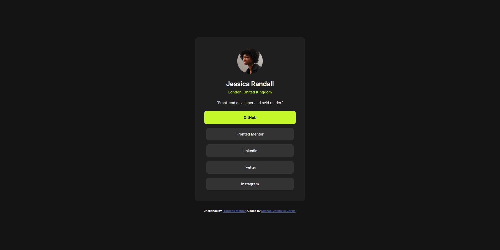
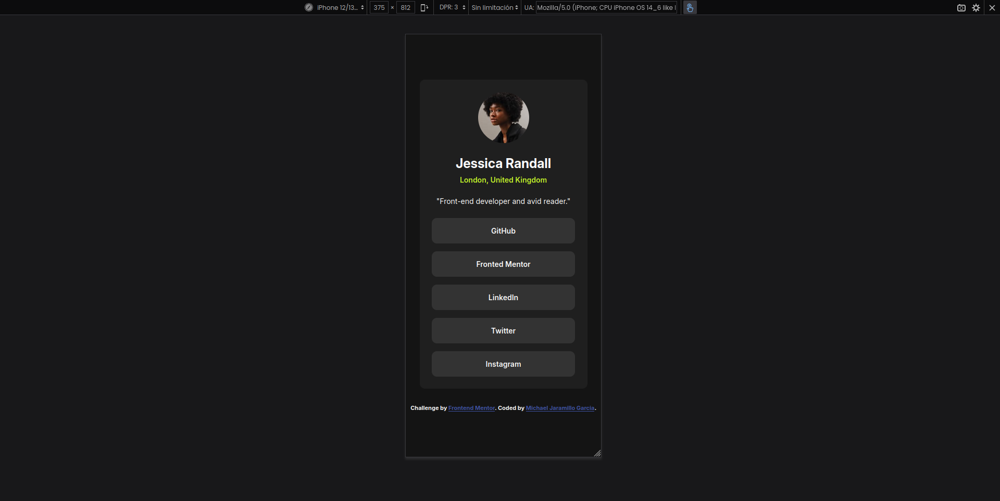
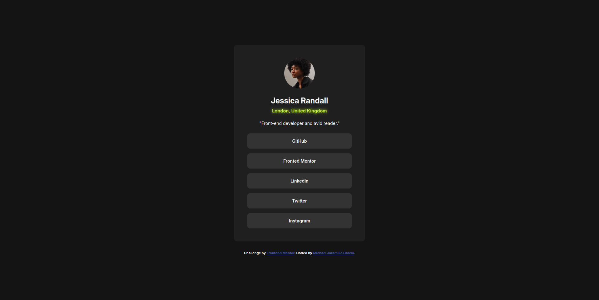

# 💡 Frontend Mentor - Social Links Profile
This is a solution to [Social Links Profile in Frontend Mentor](https://www.frontendmentor.io/learning-paths/getting-started-on-frontend-mentor-XJhRWRREZd/steps/66e1acc75832c087f249d579/challenge/start). It is a simple project focused on practicing the basics of HTML and CSS by creating a responsive card component that displays a preview of a blog post.

## 📌 Summary
In this project, I created a simple but stylish social profile that displays name, location, brief description and links to social networks. It's an excellent exercise in working on responsive design, clean styles and good practices in HTML and CSS.

## 📸 Screenshot.
### 🖥️ Desktop view

### 📱 Mobile view

### 🖱️ Hover animation

## 🌐 Live Preview
- 🔗 **Live web page**: [https://michaeljara905.github.io/Social-links-profile/](https://michaeljara905.github.io/Social-links-profile/)
- 💻 **Source code**: [https://github.com/MichaelJara905/Social-links-profile.git](https://github.com/MichaelJara905/Social-links-profile.git)

## 🛠️ Technology stack
- HTML5 semantic markup
- Custom CSS properties
- Flexbox
- Google Fonts

## My workflow
### 🗂️ Project settings
- Clear organization of folders with resources (images, fonts and styles).
- Basic HTML structure and CSS style sheet.

### 🧱 Design and Structure.
- Developed HTML layout using semantic tags for better accessibility.

### 🎨 Styling
- I used Flexbox to center the profile card both vertically and horizontally.
- Applied CSS variables and HSL colors for visual consistency.
- Custom typography using Google Fonts.

### 🚀 Deployment.
- Project deployed to GitHub Pages for easy viewing.

## 📚 What I learned.
- I delved into using Flexbox to center elements in fullscreen.
- I implemented good accessibility practices with semantic tags.
- I improved styling with :hover and transition for smooth animations.
- Practice in mobile-first and responsive design.

Define variables for later use

    :root {
      --green: hsl(75, 94%, 57%);
      --white: hsl(0, 0%, 100%);
      --grey-700: hsl(0, 0%, 20%);
      --grey-800: hsl(0, 0%, 12%);
      --grey-900: hsl(0, 0%, 8%);
    }

Add a small hover to the location subtitle

    .subtitle {

        margin: 0;
        color: var(--green);
        font-weight: 600;
        transition: transform 0.2s ease, background-color 0.3s ease;
    }

    .subtitle:hover {

        transform: scale(1.05);
        text-shadow: 0 0 8px var(--green);
        
      }

## 🔍 What I would do differently.

If I were to revise or extend this project, I would do the following:

- Add a dark/light mode to improve the user experience.
- Incorporate subtle animations when loading links.
- Use grid to explore different ways of button layout.
- Prepare the framework to scale with components in React or Vue.

## 👤 Author.
- Frontend Mentor - [@MichaelJara905](https://www.frontendmentor.io/profile/MichaelJara905)
- Instagram - [@jaramillo_maicol_0](https://www.instagram.com/jaramillo_maicol_0)
- GitHub - [@MichaelJara905](https://github.com/MichaelJara905)

## ✅ Conclusions. 
This challenge was helpful in consolidating key concepts such as focused design, visual hierarchy, and modern styling. Each exercise adds up to a solid foundation in frontend development and strengthens my path as a developer.
